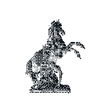

<picture>
  <source media="(prefers-color-scheme: dark)" srcset="tamer-dark.svg">
  
</picture>

 

# ALNYZ

I write bugs, then fix them

 

[Website](https://alnyz.space)&nbsp;&nbsp;·&nbsp;&nbsp;[LinkedIn](https://www.linkedin.com/in/ali-saefudin-392207244)&nbsp;&nbsp;·&nbsp;&nbsp;[Email](mailto:alnyz.co@gmail.com)

 
 

<picture>
  <source media="(prefers-color-scheme: dark)" srcset="metrics-dark.svg">
  
</picture>

 

3D model — Roßbändiger (Horse Tamer, Theodor Friedl 1892) · scan by <a href="https://sketchfab.com/3d-models/rossbandiger-1c6197c72a4a4d5d9676ed15c2c35004">noe-3d.at</a> (CC BY-NC 4.0)

